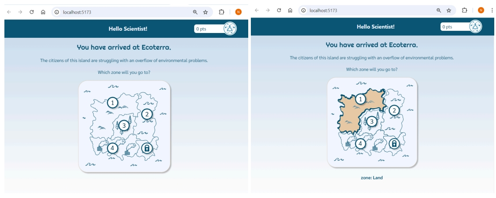

## Project summary

Unlike traditional educational tools that may struggle to maintain engagement, EcoQuest utilises the power of gamification-incorporating elements such as quizzes, achievements, and progress tracking-to make learning about climate change both enjoyable and impactful while fostering a deeper understanding of climate change, conservation, and sustainability. 
The feedback mechanism educates users on the impact of their choices, promoting responsible behaviour.

## Group project video:

https://www.youtube.com/watch?v=5lP4xQfWTaQ

## Design
Below are screenshots of our final app implementations and a feature breakdown, labelled by the iteration in which each feature was developed (MVP-1, MVP-2, MVP-3). For design reasoning, please see the prototypes and iteration section above, for detailed MVP implementation [8]

Breakdown of Screens

Welcome

Welcomes the player (MVP-2)
Offers game start (MVP-2)

Stack: 
Front-end - title.module.css, react.js for styling, buttons and layout

Character Selection Page

Player can choose from 2 paths: 
Scientist (MVP-2)
Activist (MVP-2)

Stack: 
Front-end - character.module.css for styling and layout, react.js component for handling user interactions and state, and passes the character selection to other components.

Topic/Zone Selection Map Component

Clicking a zone on the map opens the zone selection or final challenge cards (not directly the quiz). (MVP-3)
The final challenge remains locked until all topics are completed.(MVP-2)
Completed topics display a tick icon to indicate progress. (MVP-3)

On Topic Completion

If the player makes a faultless topic quiz (at least once)(MVP-2)
Players can replay all topics, earning points as usual. (MVP-2)

Component Tech Stack: 
Front-end: Built with React.js for rendering components and managing state, using CSS modules (islandMap.module.css) for styling.
Receives topic data from the back end and tracks completion status to unlock the final challenge when all topics are complete.
Fetches topic names from the database:
React.js: Sends requests to retrieve topic data.
Express.js/Node.js: Processes requests and interacts with the database.
MySQL: Stores and provides topic names and related information.

Topic/Zone Info Card

- Provides a brief description of the selected zone's problems with imageryy(MVP-3)
- Offers two options: (MVP-3)
	- Back to the topic selection 
	(in case the player rather wish to select another topic to play)
	- Enter the quiz 
-Indicates "topic is complete" on the card if the topic has been finished.(MVP-3)

Component Tech Stack: 
Front-end:React.js for rendering and state management, with CSS modules (topicEntrance.module.css) for styling.
Back-end:
React.js: Sends selected topic and completion status to the back end.
Express.js/Node.js: Manages requests between the front end and the database.
MySQL: Stores and retrieves topic descriptions and completion status.
When "Enter" is clicked, it passes topic and character data to the Quiz component.

Topic Quiz Component

Quiz length: 2 questions - generated uniquely(MVP-1)
Each question has 1 correct answer; answer order is randomised. (MVP-1)
Players is able to select answer for each questions (MVP-1)
Players can select and change answers before confirming. (MVP-1)
Hints are available if the Scientist path is chosen. (MVP-3)

Component Tech Stack: 
Front-end: React.js for rendering and managing quiz state, with CSS modules (question.module.css) for styling. Displays questions, answers, and hints fetched from the back end. The quiz is generated uniquely and the questions are requested.
Back-end:
Express.js/Node.js: Handles API requests to retrieve quiz data (questions, answers, and hints).
MySQL: Stores quiz data, including questions, answer options, and hints.

Game Bars - Dark Blue and Orange Component

Players see the remaining questions (MVP-1, developed in MVP-3)
Players see the current question's difficulty   (MVP-2)
Correct answers are worth 100 points (MVP-1)
Displays current topic(MVP-1)
Shows player’s total points (MVP-1)
UI bar (MVP-3)

Component Tech Stack: 
Front-end: React.js for rendering and managing quiz state and points allocation. With CSS modules (quiz.module.css and question.module.css) for styling displays. Questions, answers, and hints fetched from the back end.

Back-end:
Express.js/Node.js: Handles API requests to retrieve quiz data (questions, answers, hints).
MySQL: Stores and provides quiz data, including questions, answers, and hints.

Result Component

After reaching any outcomes, the game is replayable  (MVP-1)
Correct/incorrect answers  (MVP-1)
Win Zone 
-  If two questions are completed (MVP-1)
-  ‘Success’ text and paragraph (MVP-3)
- The topic is updated to completed (MVP-1)

Lose Zone 
-  If less than two questions are completed (MVP-1)
- ‘Practice more’ text and paragraph (MVP-3)

Component Tech Stack: 
Front-end: React.js for rendering the component, managing state, and displaying the number of correct answers. CSS modules (result.module.css) are used for styling and layout to ensure a consistent visual presentation.

Info Card about Final Challenge

Locked until all topics are completed (MVP-2)
Unlocked once all topics are complete (MVP-2)
Warns players that the final challenge will be the last game, and more difficult (MVP-2)
Scientist warned: hints won’t be free anymore (MVP-3)
Provides options to return to topic selection or start the final quiz (MVP-2)

Component Tech Stack: 

Front-end: React.js for rendering the component, managing state, and dynamically displaying content based on whether the final challenge is locked or unlocked. CSS modules (finalEntrance.module.css) are used for styling. The text content of the card changes depending on the selected character.

Final Challenge Quiz Component:

Final challenge can be played once (MVP-1)
Contains only difficult (weight 3) questions (MVP-1)
Players can buy hints with points, cost varies by path(MVP-3)
Activist: Cheaper hints, higher risk (Activist will lose correct answer worth many points with every wrong answer)(MVP-3)
Scientist: Expensive hints, risk of over-reliance due to free hints in main game

Component Tech Stack: 
Same stack as main topic quiz, with the addition of:
Front-end - react.js logic for buying hints

Game result (win/lose)

Win (MVP-3)
Reward: Winner’s badge and text
Encouraged to replay by suggesting the other path and providing a restart option.

Lose(MVP-3)
Reward: Participatory badge and text
Compassionate text and encouragement to replay with general text and a restart option

Component Tech Stack: 
Front-end: React.js for rendering the game result, managing state, and dynamically displaying the outcome (win or lose) with corresponding badges and text based on the player’s character. CSS modules (result.module.css) are used for styling.

## Individual Contribution
I worked extensively on prototyping in Figma, creating options for A/B testing, and I developed the MVP-2 prototype and two MVP-3 prototypes. 
For MVP-2, I implemented the character selection and intro page.
For MVP-3, I handled the main CSS changes with my colleague Volodymyr for the quiz and reward part of the app.
I provided instruction and review to Volodymyr for his additions in order for our work to be as close to the prototype as possible, and successfully created responsive grid layouts.
I also developed the main map feature for MVP-3, and helped with debugging with the rest of the team.
For other parts of the project I created and distributed final user surveys (CSI, SUS, and UMUX).
I designed all logos, imagery, and map graphics to maintain a cohesive "adventure game" style.
